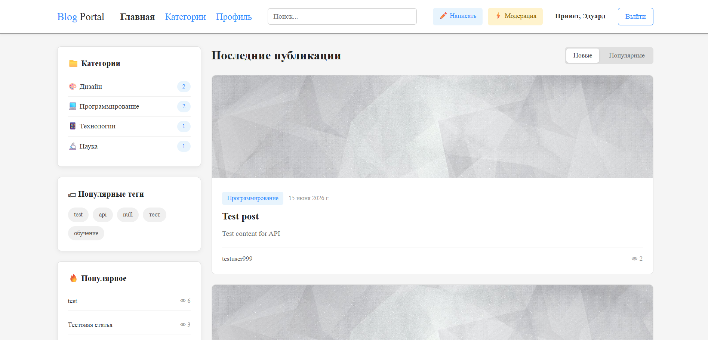
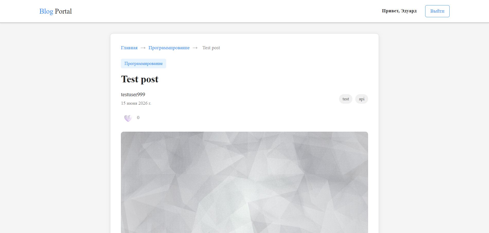
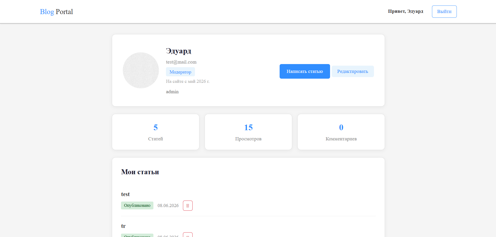
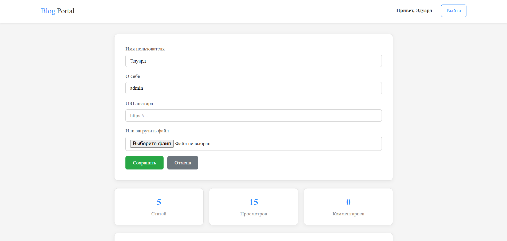
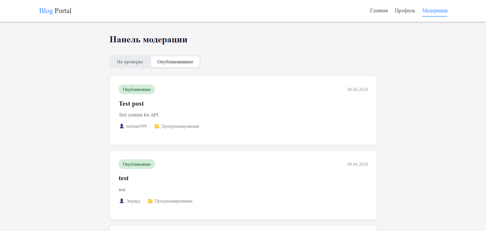

# Blog Portal

Новостной портал с модерацией на Node.js + PostgreSQL.

Авторы пишут статьи, модераторы проверяют и публикуют, читатели комментируют и оценивают.

## Стек технологий

Backend: Node.js + Express
База данных: PostgreSQL + Knex.js
Аутентификация: JWT + bcrypt
Фронтенд: HTML, CSS, JavaScript
Тестирование: Jest + Supertest

## Роли пользователей

user — читать статьи, комментировать, ставить лайки
author — всё выше + создавать и редактировать статьи, отправлять на модерацию
moderator — всё выше + одобрять/отклонять посты, удалять любые посты
admin — всё выше + назначать роли через базу данных

## Статусы постов

draft — черновик, виден только автору
review — на проверке, виден модератору
published — опубликован, виден всем

## Схема базы данных

5 таблиц: users, posts, tags, comments, likes.

Связи:
- posts.author_id ссылается на users.id
- tags.post_id ссылается на posts.id
- comments.author_id ссылается на users.id
- comments.post_id ссылается на posts.id
- likes.user_id ссылается на users.id
- likes.post_id ссылается на posts.id

## Установка и запуск

### 1. Клонировать проект

git clone https://github.com/Adward183/blog-portal.git
cd blog-portal

### 2. Установить PostgreSQL

Скачать с postgresql.org и установить.
Создать базу данных blogportal через pgAdmin.

### 3. Настроить сервер

cd server
npm install

Создать файл .env:

PORT=5000
DB_HOST=localhost
DB_PORT=5432
DB_USER=postgres
DB_PASSWORD=ваш_пароль
DB_NAME=blogportal
JWT_SECRET=blog_portal_secret_key

### 4. Создать таблицы

npx knex migrate:latest --knexfile knexfile.js

### 5. Заполнить тестовыми данными (опционально)

npx knex seed:run --knexfile knexfile.js

Тестовые пользователи (пароль у всех 123456):
- admin@blog.com (admin)
- moder@blog.com (moderator)
- author@blog.com (author)
- reader@blog.com (user)

### 6. Запустить сервер

npm run dev

Сервер запустится на http://localhost:5000

### 7. Открыть фронтенд

Открыть client/html/index.html через Live Server.

## API (22 эндпоинта)

### Авторизация

POST /api/auth/register — регистрация
POST /api/auth/login — вход
GET /api/auth/me — текущий пользователь (авторизованные)
PUT /api/auth/profile — обновить профиль (авторизованные)
GET /api/auth/stats — статистика пользователя (авторизованные)
GET /api/auth/profile/:id — публичный профиль

### Посты

GET /api/posts/published — опубликованные посты
  Параметры: page, limit, category, search, tag, sort
GET /api/posts/categories/list — список категорий
GET /api/posts/my/all — мои посты (авторизованные)
GET /api/posts/review/all — посты на модерации (moderator+)
GET /api/posts/:id — один пост
POST /api/posts — создать пост (author+)
PUT /api/posts/:id — обновить пост (автор)
PATCH /api/posts/:id/submit — отправить на модерацию (author+)
PATCH /api/posts/:id/moderate — модерировать пост (moderator+)
DELETE /api/posts/:id — удалить пост (автор или moderator+)
POST /api/posts/:id/like — лайкнуть пост (авторизованные)
GET /api/posts/:id/like — статус лайка (авторизованные)

### Комментарии

GET /api/comments/:postId — комментарии к посту
POST /api/comments/:postId — создать комментарий (авторизованные)
PUT /api/comments/:id — редактировать комментарий (автор)
DELETE /api/comments/:id — удалить комментарий (автор)

## Скриншоты

### Главная страница

### Страница поста

### Профиль

### Редактор

### Модерация

### Поиск

## Тесты

Запуск:

npm test

16 тестов в 4 группах:
- Авторизация (регистрация, вход, неверный пароль)
- Публикация (создание, модерация, получение)
- Комментарии (создание, получение, редактирование, удаление)
- Фильтрация и поиск (поиск, категории, теги, сортировка, пагинация)

## Структура проекта

blog-portal/
├── client/                  # Фронтенд
│   ├── html/               # 10 HTML страниц
│   ├── css/                # 9 CSS файлов
│   └── js/                 # 10 JS файлов
├── server/                  # Бэкенд
│   ├── routes/             # Маршруты API
│   ├── middleware/         # Проверка JWT и ролей
│   ├── migrations/         # Миграции БД
│   ├── seeds/              # Тестовые данные
│   └── tests/              # Автотесты
└── README.md